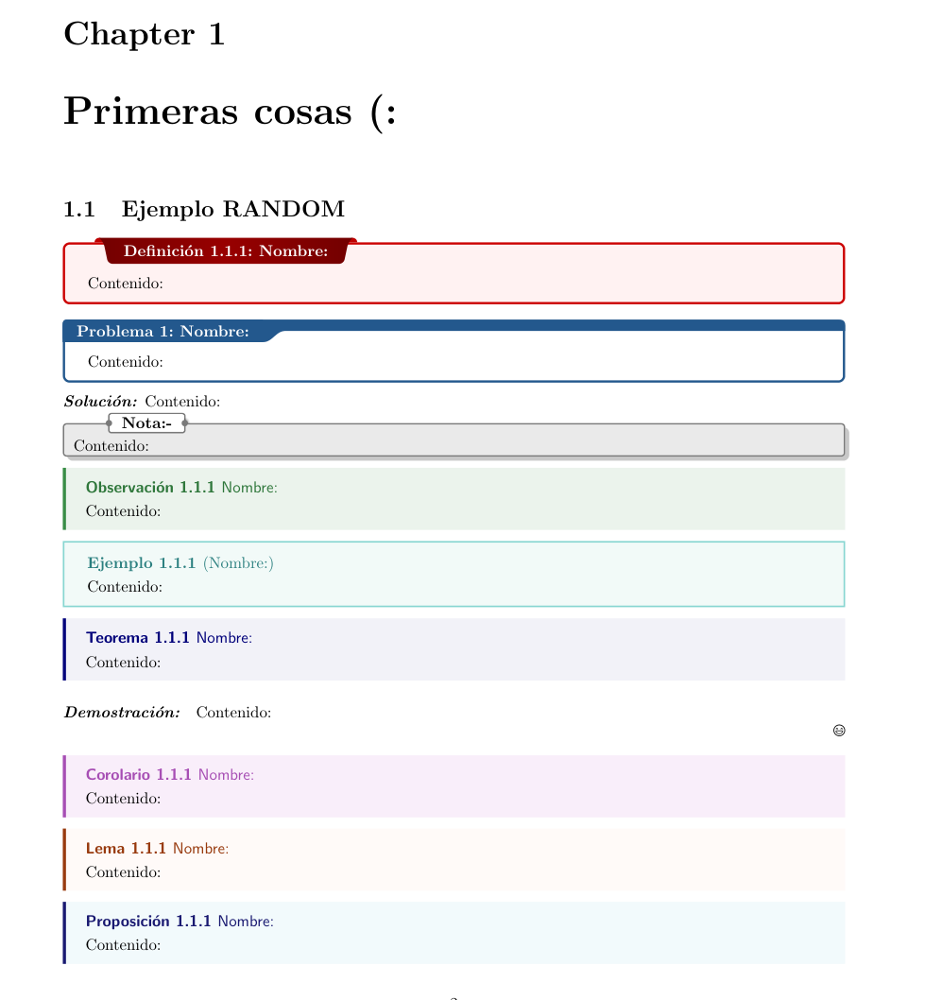
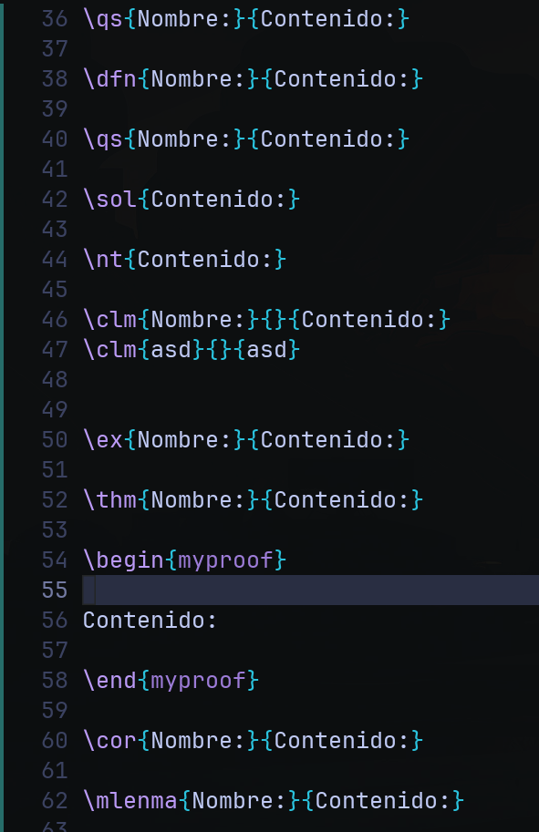
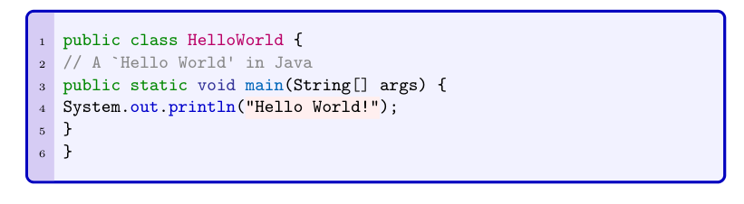
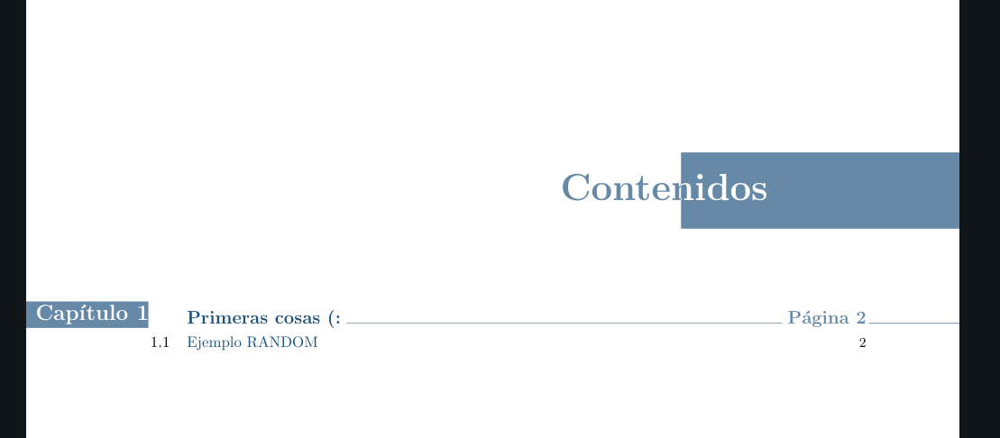
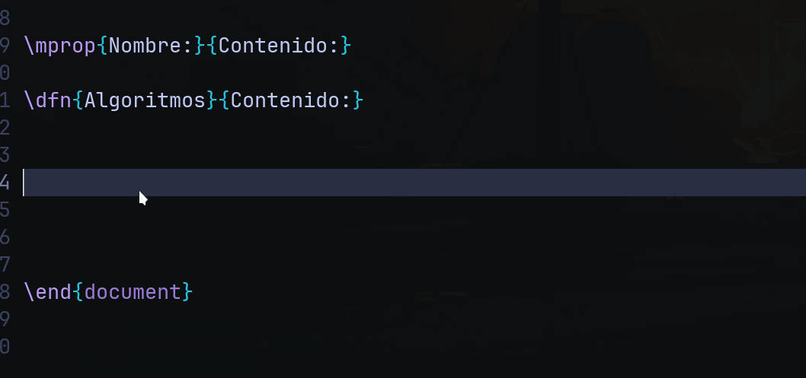
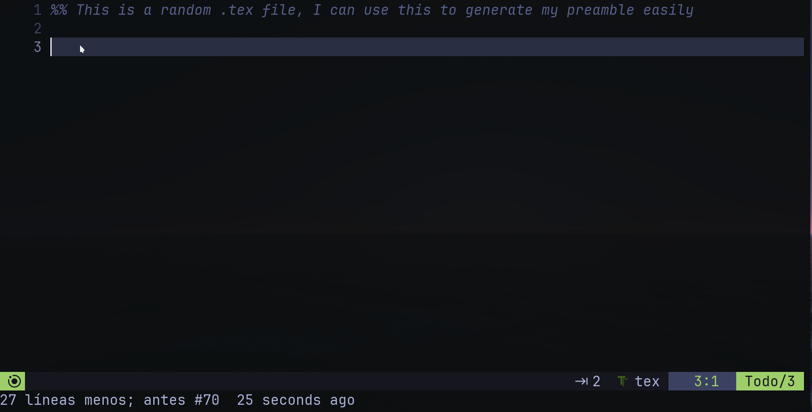

## Hi there! Hope you find this useful! :sparkles:

<b>This is a LaTeX workflow setup I use to edit my notes.</b> It heavily relies on snippets and custom definitions to streamline the process and make the workflow more efficient. 
<br>


## Roadmap:

- [ ] Make a better readme.md. 
- [ ] Automatically generate a Snippets.md file with all the translations.
- [ ] Improve modularity of the setup.
- [ ] Simplify the snippet definitions.
- [ ] Add support for internationalization (multi-language snippets).
- [ ] Integrate a well-defined and modular LaTeX preamble (still undecided).


---

## :star2: Showcase

Here's a quick preview of how the setup looks:

<div align="center">
  <table>
    <tr>
      <td colspan="2" align="center">
        
      </td>
    </tr>
    <tr>
      <td></td>
      <td></td>
    </tr>
    <tr>
      <td></td>
      <td></td> 
    </tr>
    <tr>
      <td colspan="2" align="center">
        
      </td>
    </tr>
  </table>
</div>

---

## :fire: Usage

### Language Customization

This setup is primarily in Spanish, and you'll need to make a few adjustments in three files to translate it into your preferred language. The goal is to eventually support multiple languages, but for now, here's how you can switch it up.

### File Structure

In your home directory, create a folder containing the following files:

```sh
my-preamble-latex
├── letterfonts.tex
├── macros.tex
└── preamble.tex
```

Each of these files serves a specific purpose. If you're unsure, you can open them up and check the contents. Just ensure that you're able to compile LaTeX documents after making your changes.

### Using the Files in Your LaTeX Document

To integrate these files into your LaTeX project, add the following lines to the preamble of your LaTeX document:

```tex
\documentclass{report}

\input{\string ~/my-preamble-latex/preamble.tex}
\input{\string ~/my-preamble-latex/macros.tex}
\input{\string ~/my-preamble-latex/letterfonts.tex}

\begin{document}

...

\end{document}
```

**Note:** You can modify the directory structure as you see fit, but make sure you include the files correctly to keep everything working.

### Using LuaSnip for Easy LaTeX Editing

One of the key features that makes this workflow efficient is **LuaSnip**. It's a snippets engine that helps you focus on writing the content of your documents while it handles repetitive boilerplate code. Here's an example of how it can be used:

<p align="center">

</p>

If you're using **Neovim** with **Lazy.nvim**, make sure your file structure under `~/.config/nvim/` is set up correctly. Here's how to integrate LuaSnip into your Neovim setup.

Add the following to your `lazy` configuration:

```lua
return {
  "L3MON4D3/LuaSnip",
  version = "v2.3",
  build = "make install_jsregexp",

  config = function()
    local ls = require("luasnip")

    ls.config.set_config({
      enable_autosnippets = true,
      store_selection_keys = "<Tab>",
      history = true,
      update_events = "TextChanged,TextChangedI",
      region_check_events = "InsertEnter",
      delete_check_events = "InsertLeave",
    })

    -- Lazy-load snippets for given filetypes
    require("luasnip.loaders.from_lua").lazy_load({ paths = "~/.config/nvim/lua/plugins/snippets/" })

    -- Set up key mappings for snippet expansion and jumping
    vim.cmd([[
    " Use Tab to expand and jump through snippets
    imap <silent><expr> <Tab> luasnip#expand_or_jumpable() ? '<Plug>luasnip-expand-or-jump' : '<Tab>' 
    smap <silent><expr> <Tab> luasnip#jumpable(1) ? '<Plug>luasnip-jump-next' : '<Tab>'

    " Use Shift-Tab to jump backwards through snippets
    imap <silent><expr> <S-Tab> luasnip#jumpable(-1) ? '<Plug>luasnip-jump-prev' : '<S-Tab>'
    smap <silent><expr> <S-Tab> luasnip#jumpable(-1) ? '<Plug>luasnip-jump-prev' : '<S-Tab>'
    ]])
  end,
}
```

### Directory Structure for Snippets

Make sure you have your LaTeX snippets organized in `~/.config/nvim/lua/plugins/snippets/`. Here's an example structure:

```sh
~/.config/nvim/lua/plugins/snippets/
├── snippets
│   └── tex
│       ├── <anything-1>.lua     # LaTeX snippets
│       ├── <...>.lua            # More snippets
│       └── <anything-n>.lua     
```

You can structure the snippets however you'd like—just keep them organized to help you stay on top of things.

### Resources

If you're new to LuaSnip, these resources will help you get started:

- [A LuaSnip guide for LaTeX workflows](https://ejmastnak.com/tutorials/vim-latex/luasnip/)
- [Neovim setting up snippets with LuaSnip](https://sbulav.github.io/vim/neovim-setting-up-luasnip/)
- [TJ DeVries' Introduction to LuaSnip video](https://www.youtube.com/watch?v=Dn800rlPIho)
- [L3M0N4D3's snippet examples](https://github.com/L3MON4D3/LuaSnip/blob/master/Examples/snippets.lua)

---

If you find any issues or have suggestions for improvements, feel free to open a pull request. I'd appreciate your input!
